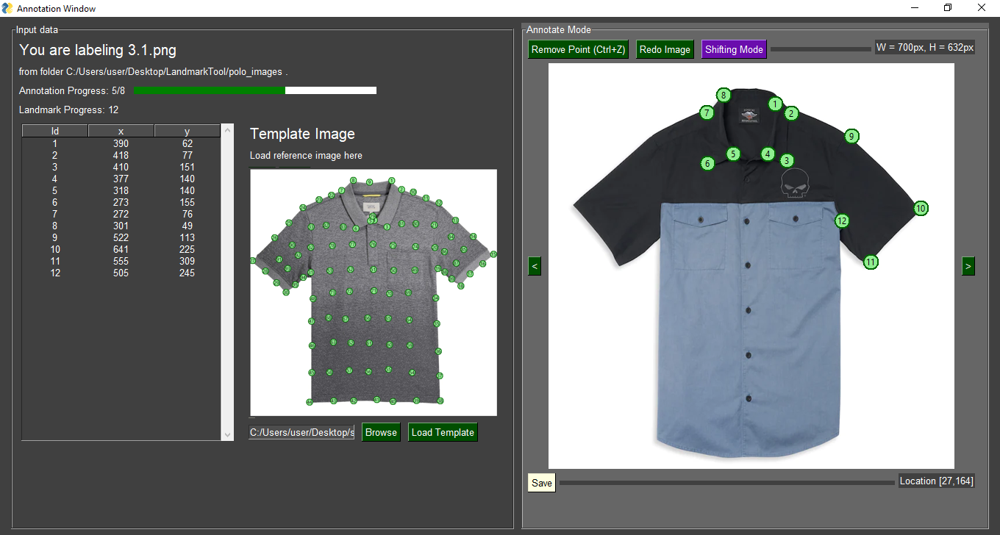
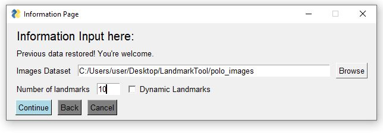
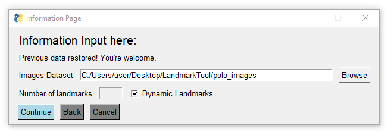
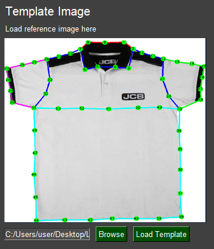

# LandmarkTool for Machine Learning Labeling

Visual Landmark Annotation Tool for Images



## Introduction

Need to annotate a huge dataset by landmarks? This is a perfect tool for you.
The simple GUI tool let you import images from your folder, then annotate them with landmarks. 

It has Undo, Redo, and Caching features, basically make your life a little bit easier. 
By using this program, we save you from minor chores such as navigating Excel files, open up Image Editor, look at coordinate of the cursor then copy it into the Excel file again. 
The most intensive work when labeling the data is when you use the mouse to click on the image. 
Moreover, this program reduce human error because you can have a good visualization of your labeling, preventing events like mistype a coordinate or accidentally swap two coordinates. 

## Prerequisite

After cloning the repository, run 
```
pip install -r requirements.txt
```
Then the program should be working fine.

This program is developed on Windows 10, Python 3.9. Please open an issue if you have any problem using this program. 

## How to use it

Use our sample folder `polo_images/` for illustration. 
Run
```
python app.py
```
An interface will pop up. 
Follow the instruction, choose the `polo_images/` folder and enter `10` landmarks, then you can start annotate the images. 
You can enter your choice of number of landmarks, `10` is being served as an example. 
If you aimed to label the data without a fixed number of landmarks (such as anomalies in medical images), enable the "Dynamic Landmarks" option. 




You can start labeling them now, enjoy the simplicity!

It is possible to load a reference image, since it could be hard to remember how to label the landmarks from time to time.



We will save your landmarks coordinate into `annotation/polo_images.csv`, which is a csv file. 
The csv file name is taken from your folder name.
You will see the columns as `x1,y1,x2,y2,...`. 
The `x,y` coordinates are recorded with top-left origin, which means the top-left corner of the image is recorded as `0,0`. 

The objective is to produce this csv file, so you can further process it to suit your need. 
For example, you can extend the columns of csv file to contain visible flags of each landmark, which is meaningful during data augmentation. 